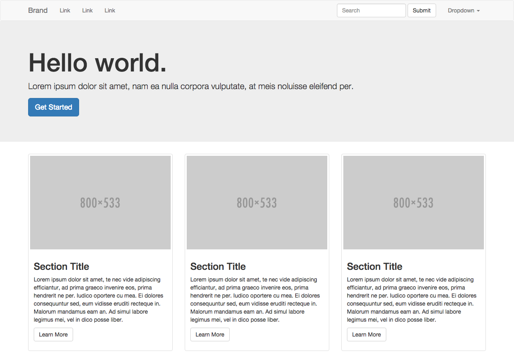
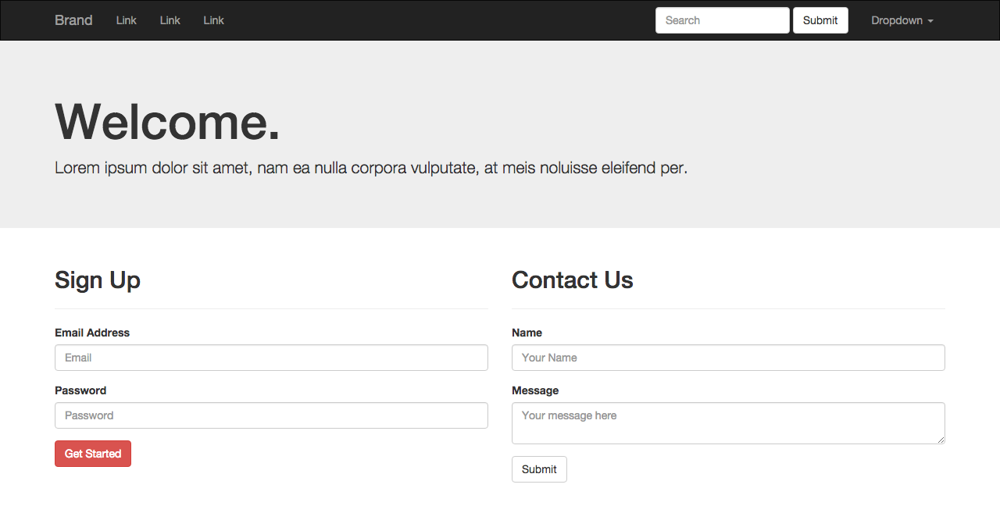

#  Bootstrap Practice

**Objective:** Re-create the following site layouts using HTML and Bootstrap.

## Getting Started

* Create an `index.html` file (or `index-01.html` and `index-02.html` if you're building both layouts).
* Read the <a href="http://getbootstrap.com/getting-started" target="_blank">Boostrap docs</a> to get started. In `index.html` you'll need:
  * `meta` tag to set the viewport (makes your site responsive)
  * Bootstrap CSS CDN
  * jQuery CDN (must come before Bootstrap JS)
  * Bootstrap JavaScript CDN
* You won't need to write any of your own CSS for this exercise, but we've included a `main.css` file that fixes the margin between the `navbar` and `jumbotron`. Make sure to link to `main.css` in your HTML file to get this fix.
* Note that you need jQuery and Bootstrap's JavaScript library to make some of Bootstrap's components work (e.g. mobile nav), but you won't be writing any jQuery or JavaScript in this exercise.

## Layout #1

## Layout #2

